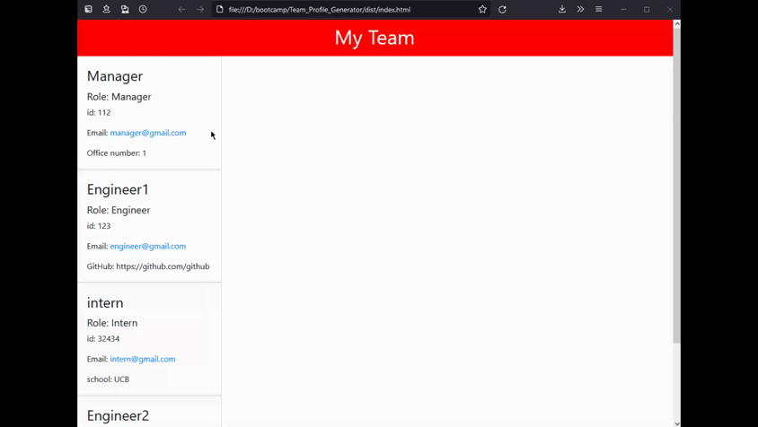
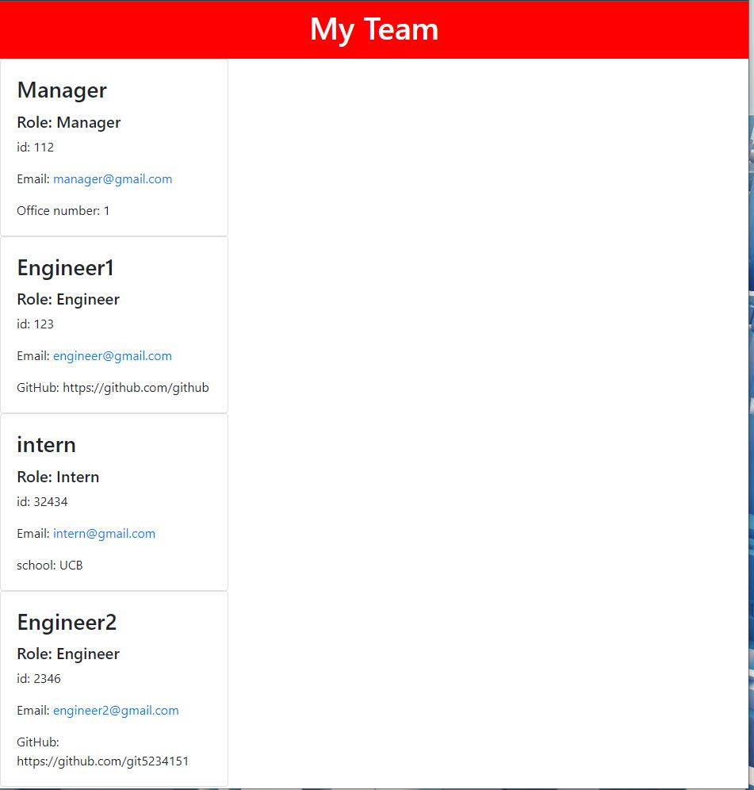
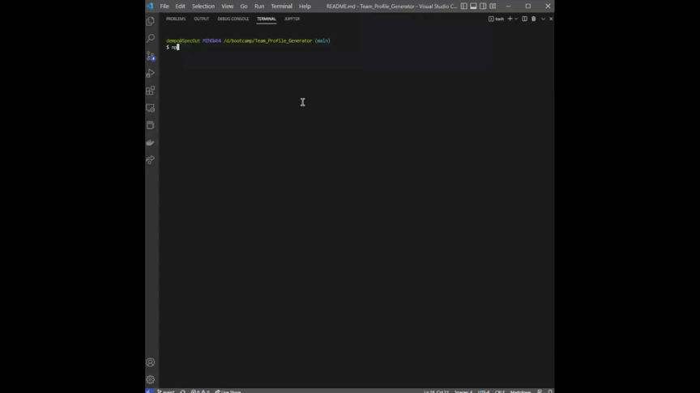

# Team Profile Generator

## Description <br>
The application is a command line application ran through node.js. A team manager can quickly create a webpage containing information about their team. The information for team members include their name, id, email, and role. The manager has an included office number, and the engineeres and interns have their github link or school information.
<br>
[Demo-Video](https://youtu.be/owJ-WARhkao)
<br>
Included in the link above is a demo video recorded with Screencastify. There is no sound since screencastify is very buggy on my computer.
<br>

<br>

<br>


## Table of Contents
[Installation](#Installation)<br>
[Usage](#Usage)<br>
[License](#Team-Profile-Generator)<br>
[Contributing](#Contributing)<br>
[Tests](#Tests)<br>
[Questions](#Questions)<br>
    

## Installation
To install the application first clone the repository to the desired directory.
- Install all package dependencies with
```
npm i
```

## Usage
To use the application, you must first install all package dependencies. Then enter the command below.
```
npm start
```

## Contributing
To contribute to the project create a fork of the repository. Create a pull request for any changes you would like to add.

## Tests
To test the application run the following command:
```
npm test
```

## Dev Notes
From working with this project I learned:
- object oriented programming with javascript
- how to make unit tests with jest
- advanced applications of inquirer
- project folder and file structure
- making helper functions to generate html for the classes

## Questions
If you have any questions about the repo, open an issue or contact me directly at [dempoleon@gmail.com](dempoleon@gmail.com).
You can find more of my work at [dempleon](https://github.com/dempleon)


